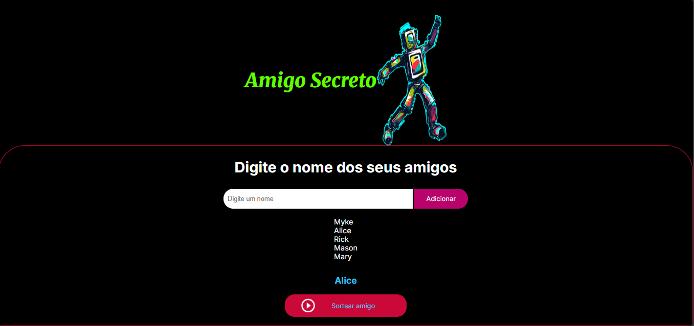

<h1 align="center"> Amigo Secreto 🔍</h1>

<p align="center">
  
</p>

##  Sobre o projeto
Este projeto foi criado a partir do desafio **"Challenge Amigo Secreto"** da Alura, como uma forma de testar as habilidades aprendidas no programa **Alura + Oracle G8-ONE**.  

O desafio é construir uma aplicação que permita aos usuários inserir nomes de amigos em uma lista para, em seguida, realizar um sorteio aleatório e determinar quem é o "amigo secreto".  

## 🛠 Tecnologias utilizadas
- HTML  
- CSS  
- JavaScript  

## 🚀 Como executar o projeto  

Para rodar o projeto localmente, siga os passos abaixo no **terminal do seu computador**:  

1. **Abra o terminal** e execute o seguinte comando para clonar o repositório:  
   ```sh
   git clone https://github.com/MykeRamon/amigo-secreto.git

